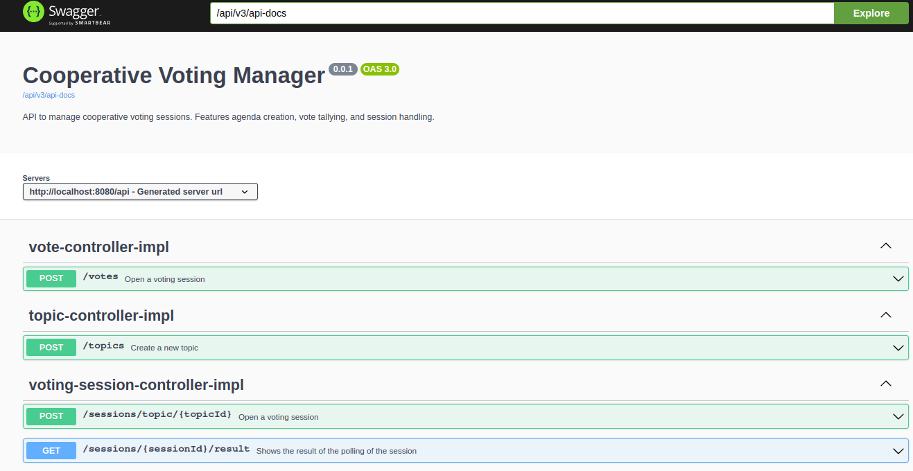
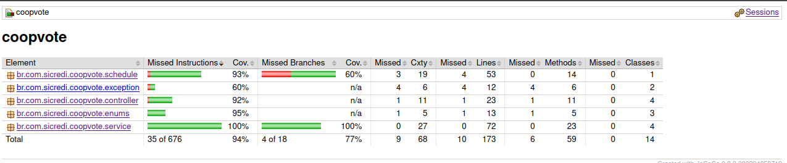

# Sistema de Votação

Para rodar o projeto, é necessário executar o seguinte comando:
```bash 
docker-compose up -d
```
Este projeto é um serviço RESTful dedicado a gerenciar tópicos de votação, registrar votos e exibir os resultados das sessões de votação.

## Controladores

### Controlador de Tópicos (`TopicControllerImpl`)

- **Endpoint:** `/topics`
- **Operações:**
  - **POST**: Cria um novo tópico de votação.
    - **Payload**:
      ```json
      {
        "id": 0,
        "description": "string"
      }
      ```
    - **Response**:
      ```json
      {
        "error": true,
        "status": 0,
        "message": "string",
        "content": {
          "id": 0,
          "description": "string"
        }
      }
      ```

### Controlador de Votos (`VoteControllerImpl`)

- **Endpoint:** `/votes`
- **Operações:**
  - **POST**: Registra um voto em uma sessão de votação.
    - **Payload**:
      ```json
      {
        "votingSessionId": 0,
        "memberId": 0,
        "voteValue": "YES"
      }
      ```
    - **Responses**:
      ```json
      {
        "error": true,
        "status": 0,
        "message": "string",
        "content": {
          "votingSessionId": 0,
          "memberId": 0,
          "voteValue": "YES"
        }
      }
      ```

### Controlador de Sessões de Votação (`VotingSessionControllerImpl`)

- **Endpoint:** `/sessions/topic/{topicId}`
  - **param:** topicId
  - **query string:** durationMinutes (Default value: 1)
  - **Response**:
    ```json
    {
      "error": true,
      "status": 0,
      "message": "string",
      "content": {
        "id": 0,
        "topic": {
          "id": 0,
          "description": "string"
        },
        "openingDate": "2023-08-29T22:03:22.232Z",
        "durationMinutes": 0
      }
    }
    ```

- **Endpoint:** `/sessions/{sessionId}/result`
  - **Response**:
    ```json
    {
      "error": true,
      "status": 0,
      "message": "string",
      "content": {
        "topicId": 0,
        "topicDescription": "string",
        "sessionId": 0,
        "totalVotes": 0,
        "yesVotes": 0,
        "noVotes": 0,
        "result": "YES_WINS",
        "votingSessionStatus": "VOTING_OPEN"
      }
    }
    ```

## Entidades

- **Pauta (`Topic`)**: Representa uma pauta de votação.
- **Voto (`Vote`)**: Representa um voto.
- **Sessão de Votação (`VotingSession`)**: Representa uma sessão de votação.

## Agendamentos

O sistema possui uma rotina de atualização programada para sessões de votação que já expiraram. Esta rotina calcula os resultados e utiliza o RabbitMQ para enviar mensagens com os resultados das votações.

## Versionamento de Banco de Dados com Flyway

Utilizamos o Flyway para gerenciar e versionar os scripts de banco de dados. Os scripts estão localizados no diretório `classpath:db/migration`.

### Migrations:

#### V1 - Criação da tabela de tópicos

Arquivo: `db/migration/V1__create_topic_table.sql`:

```sql
CREATE TABLE TOPIC (
  ID BIGSERIAL PRIMARY KEY,
  DESCRIPTION VARCHAR(255) NOT NULL
);
```
#### V2 - Criação da tabela de sessões de votação

Arquivo: db/migration/V1__create_topic_table.sql:

```sql
CREATE TABLE VOTING_SESSION (
  ID BIGSERIAL PRIMARY KEY,
  ID_TOPIC BIGSERIAL NOT NULL,
  OPENING_DATE TIMESTAMPTZ DEFAULT CURRENT_TIMESTAMP,
  DURATION_MINUTES INTEGER,
  IS_OPEN BOOLEAN DEFAULT TRUE,
  FOREIGN KEY (ID_TOPIC) REFERENCES TOPIC(id)
);
```
#### V3 - Criação da tabela de votos

Arquivo: db/migration/V3__create_vote_table.sql:

```sql
CREATE TABLE VOTE (
    ID BIGSERIAL PRIMARY KEY,
    ID_VOTING_SESSION BIGSERIAL NOT NULL,
    ID_MEMBER BIGINT NOT NULL,
    VOTE_VALUE VARCHAR(3) NOT NULL,
    FOREIGN KEY (ID_VOTING_SESSION) REFERENCES VOTING_SESSION(id)
);
```
#### V4 - Adição de colunas na tabela de tópicos

Arquivo: db/migration/V4__insert_columns_topic_table.sql:

```sql
ALTER TABLE TOPIC
ADD COLUMN VOTE_DIFFERENCE INT DEFAULT 0;

ALTER TABLE TOPIC
ADD COLUMN VOTING_RESULT VARCHAR(255);
```

## Logs do Sistema

O sistema implementa um mecanismo de registro de logs robusto para garantir transparência e rastreabilidade das operações. Abaixo, temos uma descrição de como os logs são apresentados no sistema:

### Estrutura do Log

Os logs são estruturados da seguinte maneira:

- **app_name**: O nome da aplicação.
- **uuid_request**: O UUID gerado para cada solicitação, permitindo rastrear uma solicitação específica ao longo de todo o seu ciclo de vida.
- **method**: Método HTTP da solicitação (por exemplo, GET, POST).
- **date_begin** e **date_end**: Marcas de tempo indicando o início e o fim da solicitação.
- **message**: Uma mensagem descritiva associada ao log, como "Iniciando Requisição" ou "Finalizando Requisição".
- **URI**: O endpoint da API que está sendo acessado.
- **payload** (se aplicável): O corpo da solicitação, especialmente útil para solicitações POST.

### Exemplos de Logs:

```plaintext
2023-08-29T22:11:39.117-03:00  INFO 95247 --- [nio-8080-exec-6] b.c.s.c.interceptor.LoggingInterceptor   : app_name=CoopVote | uuid_request=a1f8c226-378d-4e6d-a651-0d21f6dcf623 | method=POST | date_begin=29/08/2023 22:11:39.117 | message=Initiating Request | URI=/api/topics
2023-08-29T22:11:39.118-03:00  INFO 95247 --- [nio-8080-exec-6] .c.s.c.i.LoggingPayloadAdviceInterceptor : app_name=CoopVote | uuid_request=a1f8c226-378d-4e6d-a651-0d21f6dcf623 | method=POST | payload={"id":null,"description":"Pauta de Votacao"} | URI=/api/topics
2023-08-29T22:11:39.127-03:00  INFO 95247 --- [nio-8080-exec-6] b.c.s.c.interceptor.LoggingInterceptor   : app_name=CoopVote | uuid_request=a1f8c226-378d-4e6d-a651-0d21f6dcf623 | method=POST | date_end=29/08/2023 22:11:39.127 | message=Finalizing Request | URI=/api/topics
2023-08-29T22:11:42.782-03:00  INFO 95247 --- [nio-8080-exec-7] b.c.s.c.interceptor.LoggingInterceptor   : app_name=CoopVote | uuid_request=5f48ee57-e3d0-4fc7-a392-1ed6670f5723 | method=POST | date_begin=29/08/2023 22:11:42.782 | message=Initiating Request | URI=/api/sessions/topic/3
2023-08-29T22:11:42.795-03:00  INFO 95247 --- [nio-8080-exec-7] b.c.s.c.interceptor.LoggingInterceptor   : app_name=CoopVote | uuid_request=5f48ee57-e3d0-4fc7-a392-1ed6670f5723 | method=POST | date_end=29/08/2023 22:11:42.794 | message=Finalizing Request | URI=/api/sessions/topic/3
2023-08-29T22:13:22.644-03:00  INFO 95247 --- [   scheduling-1] b.c.s.c.s.MessageSenderServiceImpl       : Send message: {"topicId":3,"topicDescription":"Pauta de Votacao","sessionId":2,"totalVotes":0,"yesVotes":0,"noVotes":0,"result":"TIED","votingSessionStatus":"VOTING_CLOSED"}
2023-08-29T22:13:22.645-03:00  INFO 95247 --- [   scheduling-1] b.c.s.c.s.MessageSenderServiceImpl       : Message was sent successfully.
```

## Documentação API

A documentação da API, gerada pelo Swagger, pode ser acessada através da URL: `http://localhost:8080/api/swagger-ui.html`

## Tecnologias e ferramentas

- **Spring Boot**: Framework principal.
- **Swagger/OpenAPI**: Documentação e definição da API.
- **google-java-formatter**: Lint para manter um padrão de código.
- **jacoco**: Relatórios de cobertura de código.
- **RabbitMQ**: Sistema de mensageria utilizado para envio de atualizações sobre as sessões de votação.
- **JUnit**: Framework utilizado para a criação de testes unitários.
- **Mockito**: Framework utilizado para criar mocks em testes unitários.

# Testes do Sistema

O sistema emprega diversas abordagens de teste para garantir qualidade, eficiência e robustez.

## 1. Testes de Arquitetura

Os testes de arquitetura verificam se o código segue padrões e normas arquiteturais estabelecidos. Por exemplo, a classe `ControllerTest` assegura que todos os controladores tenham a anotação `@RestController` e residam no pacote correto. Semelhantemente, a classe `EntityTest` confirma que todas as classes de domínio estejam anotadas com `@Entity`.

## 2. Testes Unitários

Estes testes focam em unidades individuais do software, garantindo que elas funcionem como esperado em isolamento. Por exemplo, `MessageSenderServiceImplTest` testa a lógica de envio de mensagens, usando mocks para simular interações com componentes externos.

## 3. Testes Integrados

Os testes integrados visam garantir que diferentes partes do sistema trabalhem juntas de maneira correta. Utilizamos o banco de dados em memória H2 para simular interações reais com o banco de dados. A classe `TopicControllerImplTest`, por exemplo, é um teste que valida a criação de tópicos através de requisições HTTP, interagindo com o banco de dados H2 em memória para simular o ambiente real.

---

Além destes, o sistema possui várias outras classes e métodos de teste que trabalham juntos para garantir que tudo funcione como esperado, abrangendo diferentes cenários e situações.


## Capturas de tela

### Swagger UI



### Relatório de Cobertura Jacoco


